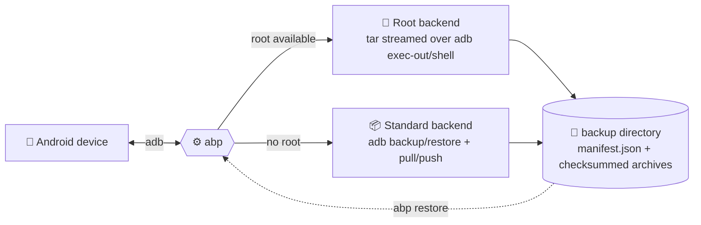

<div align="center">

# 📱🔒 abp — ADB Backup Program

**Full Android backups over ADB, from the comfort of your Linux terminal.**

Apps · APKs (incl. split APKs) · Private app data · Shared storage — captured, checksummed, and restorable.

[](LICENSE)
[](https://github.com/guillaume-behr/abp/actions/workflows/ci.yml)
[](CMakeLists.txt)
[](CMakeLists.txt)
[](#-requirements)
[](#-why)

</div>

---

`abp` is a Linux command-line tool for making full backups of Android
devices over ADB and restoring them — including installed apps, their
private data, and shared storage (photos, downloads, etc). It works on
stock, non-rooted devices via ADB's own backup mechanism, and on rooted
devices via a much more complete `tar`-over-ADB pipeline.

Written in modern **C++17**, built with **CMake**, and with **zero
third-party runtime dependencies** beyond a working `adb` (and, for
root-mode backups, root access on the device).



## 🤔 Why

Android's built-in backup story is fragmented: `adb backup` is deprecated,
silently skips any app with `android:allowBackup="false"` (the default for
apps targeting recent SDKs), and can't capture split APKs or arbitrary
files. `abp` gives you a single tool that:

- 🔍 Uses the best available mechanism automatically (root if present,
  otherwise the standard ADB flow), or lets you force one.
- 📂 On rooted devices, captures the **entire** private data directory of
  every app (not just what the app opted into), plus its full APK set
  (base + split APKs), plus all of shared storage.
- 🔐 Without root, still captures debuggable apps' complete private data
  through `run-as`, as proper per-app archives — falling back to the
  legacy flow only for apps it cannot reach that way. See the
  [coverage table](#-what-each-mode-can-save).
- 🧾 Writes a single, versioned, human-readable `manifest.json` describing
  exactly what was captured, with SHA-256 checksums so a restore can
  detect a corrupted or truncated archive before touching the device.
- 🛡️ Restores app data with correct ownership (UID/GID) and SELinux
  context, not just a raw file dump.

## ✨ Features

| | |
|---|---|
| 🔎 **Device discovery** | `abp devices`, `abp info` — model, Android version, root status. |
| 📋 **Package enumeration** | `abp list-packages`, with JSON output for scripting. |
| 💾 **Full backup** | APKs (incl. split APKs), per-app private data, and shared storage — selectable independently. |
| ♻️ **Full restore** | Reinstalls APKs, restores app data with UID remapping + SELinux relabeling, restores shared storage. |
| 🔧 **Root backend** | Streams `tar` archives of each app's data directory (and of `/sdcard`) over `adb exec-out`/`shell` — never buffers large data in host memory. |
| 📦 **Standard backend** | No root required: per-app `tar` via `run-as` for debuggable apps, legacy `adb backup` for the rest, `adb pull`/`push` for shared storage. |
| 🗄️ **Whole-partition pull** | `--all-files` / `--pull-path` copy device paths verbatim via `adb pull`, recording what was readable. |
| 🎯 **Selective ops** | `--only`, `--exclude`, `--no-apks`, `--no-data`, `--no-shared`, `--system`. |
| ✅ **Integrity checking** | Every archive is SHA-256 checksummed at backup time and verified before it's written back to the device. |
| 🔒 **No shell-injection surface** | Every device command is built from validated package names/paths — never raw string concatenation of untrusted input. |

See [docs/ROOT_BACKUP.md](docs/ROOT_BACKUP.md) for exactly what root mode
does on-device, and [docs/MANIFEST.md](docs/MANIFEST.md) for the backup
directory layout and manifest schema.

## 📊 What each mode can save

`abp` picks the strongest mechanism available and tells you which one it
used. Non-root mode is not one mechanism but three, chosen per app, so
coverage varies app by app rather than all-or-nothing:

| What | 🔓 Root mode | 🔐 Non-root, debuggable app | 🔐 Non-root, ordinary app |
|---|---|---|---|
| **APKs** (base + all splits) | ✅ Full | ✅ Full | ✅ Full |
| **Private app data** (`/data/data/<pkg>`) | ✅ Complete, every app | ✅ Complete, via `run-as` | ⚠️ Only via legacy `adb backup` — see below |
| **Shared storage** (`/sdcard`) | ✅ Single `tar` stream | ✅ `adb pull` tree | ✅ `adb pull` tree |
| **Per-app archives** | ✅ One per package | ✅ One per package | ❌ One shared `.ab` archive |
| **Selective restore** (`--only`/`--exclude`) | ✅ Per package | ✅ Per package | ❌ Archive restores as a whole |
| **SHA-256 integrity check** | ✅ | ✅ | ❌ Not available for `adb backup` output |
| **On-device confirmation needed** | ✅ None | ✅ None | ⚠️ Must tap "Back up my data" |
| **Correct UID/SELinux on restore** | ✅ Remapped + `restorecon` | ✅ Inherent — `tar` runs as the app | ✅ Handled by Android |
| **System apps** | ✅ With `--system` | ⚠️ APKs only (system apps are not debuggable) | ⚠️ APKs only |
| **Whole partitions** (`--all-files`) | ✅ All of `/data`, `/system`, ... | ⚠️ Readable parts only — most of `/data` is root-only | ⚠️ Readable parts only |
| **OS state** (Wi-Fi, accounts, settings) | ❌ Out of scope | ❌ Out of scope | ❌ Out of scope |

**How an app lands in each non-root column.** `run-as` runs a command as
an app's own UID, which Android permits only for apps built with
`android:debuggable="true"` — your own debug builds, and a fair number of
F-Droid and sideloaded apps. `abp` probes every selected package in one
pass and captures whatever it can that way; everything left over falls
back to legacy `adb backup`, which Google deprecated, which skips apps
with `android:allowBackup="false"`, and which on Android 12+ skips app
data unless the app explicitly opts in. If `run-as` covers every selected
package, `abp` skips the legacy flow entirely — and with it the on-device
prompt.

Run `abp backup` and read the summary: it reports how many packages were
captured by each mechanism, and `manifest.json` records a
`data_capture_method` per package (`root_tar`, `run_as_tar`, or
`legacy_adb_backup`) so you can tell exactly what you got.

### Pulling whole partitions

On top of the per-app captures, `--all-files` copies every persistent
device partition verbatim with `adb pull`:

```sh
# Everything adb can read: /data, /sdcard, /system, /vendor, /product, ...
abp backup -o ~/backups/full --all-files

# Or name exactly what you want (repeatable):
abp backup -o ~/backups/logs --pull-path /data/misc --pull-path /data/system
```

Each tree lands under `filesystem/` in the backup and is recorded in
`manifest.json` with its size and whether `adb pull` could read all of
it — without root, most of `/data` cannot be read, and `abp` says so
rather than presenting a partial copy as a complete one.

Two things to know:

- **`abp` refuses to pull `/`, `/proc`, `/sys` and `/dev`.** Those are
  kernel pseudo-filesystems, not stored files: `/proc/kcore` alone
  exposes all of physical memory, and reading a device node can block
  forever. Name real paths instead.
- **These captures are never restored automatically.** Pushing a whole
  partition back over a running system is not safe to automate — writing
  `/system` can leave a device unbootable. `abp restore` reports what is
  there and leaves it for you to copy by hand.

## ⚙️ Requirements

- A C++17 compiler (GCC ≥ 9 or Clang ≥ 10) and CMake ≥ 3.16 — only needed
  if you build from source; the install script below builds it for you.
- `adb` (Android Platform Tools) installed and on your `PATH`, or pointed
  to explicitly with `--adb-path` / `ABP_ADB_PATH`.
- USB debugging enabled on the target device, and the host authorized
  (`adb devices` should show it as `device`, not `unauthorized`).
- For root-mode backups: either a `su` binary reachable from the adb
  shell user (Magisk, KernelSU, etc.) or a userdebug/eng build where
  `adbd` already runs as root.

## 📦 Installation

### 🚀 Quick install (recommended)

```sh
curl -fsSL https://raw.githubusercontent.com/guillaume-behr/abp/master/install.sh | bash
```

This clones the repo into a temporary directory, builds `abp` with
CMake, installs the binary to `/usr/local/bin` (or `~/.local/bin` if
that's not writable), and cleans up after itself. Re-run it any time to
update to the latest `master`.

<details>
<summary>Customize the install (version, install directory)</summary>

```sh
# Install a specific branch/tag:
ABP_VERSION=v1.0.0 curl -fsSL https://raw.githubusercontent.com/guillaume-behr/abp/master/install.sh | bash

# Install somewhere else:
ABP_INSTALL_DIR="$HOME/bin" curl -fsSL https://raw.githubusercontent.com/guillaume-behr/abp/master/install.sh | bash
```

</details>

### 🗑️ Uninstall

```sh
curl -fsSL https://raw.githubusercontent.com/guillaume-behr/abp/master/uninstall.sh | bash
```

> As with any `curl | bash` installer, feel free to inspect
> [`install.sh`](install.sh) / [`uninstall.sh`](uninstall.sh) before
> running them — they only clone, build, copy/remove one binary, and
> clean up after themselves. No `sudo` is invoked automatically; you'll
> only be prompted for a password if your shell's `PATH` setup requires
> writing to a root-owned directory.

### 🛠️ Build from source manually

```sh
git clone https://github.com/guillaume-behr/abp.git
cd abp
cmake -B build -DCMAKE_BUILD_TYPE=Release
cmake --build build -j"$(nproc)"
ctest --test-dir build --output-on-failure   # optional: run the unit tests
sudo cmake --install build                   # optional: install system-wide
```

Useful CMake options:

| Option                      | Default | Description                                   |
|------------------------------|---------|------------------------------------------------|
| `ABP_BUILD_TESTS`            | `ON`    | Build the `abp_tests` unit test binary.        |
| `ABP_WARNINGS_AS_ERRORS`     | `OFF`   | Treat compiler warnings as errors (used in CI).|

## 🚀 Usage

```text
abp devices                                  # list connected/authorized devices
abp info [-s SERIAL]                         # model, Android version, root status
abp list-packages [-s SERIAL] [--system]     # installed packages

abp backup  -o ./my-backup [options]         # back up
abp restore -i ./my-backup [options]         # restore
```

### 💾 Backing up

```sh
# Back up everything abp can reach, auto-detecting root:
abp backup -o ~/backups/pixel-2026-01-01

# Force standard (non-root) mode, apps only, skip shared storage:
abp backup -o ~/backups/quick --standard --no-shared

# Only two specific apps, including their private data:
abp backup -o ~/backups/subset --only com.example.one,com.example.two
```

In standard (non-root) mode, `abp` first captures every app it can reach
through `run-as` — that is, every app built with
`android:debuggable="true"` — as a complete per-app archive, with no
prompting. Only the apps left over fall back to the legacy `adb backup`
mechanism, which requires you to unlock the device and tap **"Back up my
data"** when prompted; `abp` waits for that confirmation. That legacy
path only captures apps with `android:allowBackup="true"`, and on
Android 12+ only those that explicitly opt in. Root mode has no such
limitations. See [what each mode can save](#-what-each-mode-can-save).

### ♻️ Restoring

```sh
abp restore -i ~/backups/pixel-2026-01-01
```

The backup's own `manifest.json` records whether it was captured in root
or standard mode, and the restore uses the matching mechanism
automatically — you don't need to specify it again. Restoring into a
non-rooted device from a root-mode backup will still reinstall APKs, but
app data and shared storage cannot be restored without root.

Run `abp --help`, or see [docs/USAGE.md](docs/USAGE.md), for the full
option reference and more examples.

## ⚠️ Limitations

This is not a substitute for verified, tested backup software for
anything you cannot afford to lose:

- Standard mode captures ordinary (non-debuggable) apps only through
  `adb backup`, which Google has deprecated and which most modern apps
  opt out of. For those apps treat it as "some data if you're lucky,"
  not a full backup — the [coverage table](#-what-each-mode-can-save)
  spells out which apps get which treatment.
- `run-as` capture depends on the app still being installed and still
  debuggable at restore time; an app rebuilt as a release build cannot
  have its `run_as_tar` archive restored.
- Root-mode UID remapping assumes the app has already been (re)installed
  with a clean data directory before its archive is extracted; restoring
  onto a device where the package was never freshly installed may leave
  incorrect file ownership until the app is relaunched.
- System apps and OS-level state (Wi-Fi credentials, accounts, device
  settings) are out of scope; `abp` backs up app data and media, not the
  whole device image. `--all-files` gets you the raw partitions, but
  turning those back into a working device is not something `abp` does.
- `--all-files` on a non-rooted device captures only what the adb shell
  user can read, which excludes nearly all of `/data`. The manifest
  marks such a capture incomplete — check it before relying on it.
- No encryption is applied to backup archives. If your backups may
  contain sensitive data, store them on encrypted media.

## 📚 Documentation

| Doc | What's in it |
|---|---|
| [docs/USAGE.md](docs/USAGE.md) | Full command/option reference, examples, troubleshooting. |
| [docs/ARCHITECTURE.md](docs/ARCHITECTURE.md) | How the code is layered. |
| [docs/ROOT_BACKUP.md](docs/ROOT_BACKUP.md) | Exactly what root mode does on-device. |
| [docs/NON_ROOT_BACKUP.md](docs/NON_ROOT_BACKUP.md) | The three mechanisms standard mode uses, and their limits. |
| [docs/MANIFEST.md](docs/MANIFEST.md) | Backup directory layout and `manifest.json` schema. |

## 🤝 Contributing

Contributions are welcome — see [CONTRIBUTING.md](CONTRIBUTING.md).

## 📄 License

[MIT](LICENSE) — do what you like with it, just keep the copyright notice.
