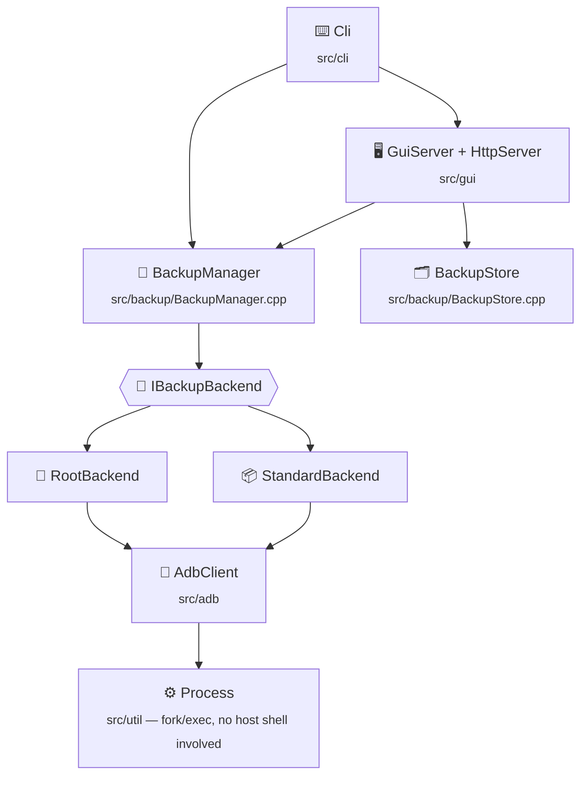

# 🏗️ Architecture

`abp` is organized in layers, each of which only talks to the layer
directly below it:

## ⌨️ Cli

Parses `argv` into a subcommand and its options (hand-rolled, no argument
parsing library — the option set is small and stable enough that a
generic parser would add a dependency for little benefit). Prints
usage/errors, asks for interactive confirmation before a backup/restore
unless `-y`/`--yes` is given, and turns a `BackupSummary`/`RestoreSummary`
into human-readable output. `abp gui` is parsed here too, but hands off
immediately to `GuiServer`.

## 🖥️ GuiServer

`abp gui` serves a single-page app (compiled into the binary from
`src/gui/web/index.html`) plus the JSON API it drives, on top of
`HttpServer` — a ~350-line HTTP/1.1 server that speaks just enough of the
protocol for a local, single-origin app: one thread per connection, no
keep-alive, no TLS.

The API layer holds no backup logic of its own. It parses a request into
the same `BackupOptions`/`RestoreOptions` the CLI builds, hands them to
`BackupManager` on a worker thread, and streams progress back by
installing a `Logger` sink that tees every log line into the running
job's buffer. One job runs at a time, which is also why a process-global
logger sink is enough.

Requests are authenticated with a token generated at startup and
validated on every `/api/...` call; see [GUI.md](GUI.md) for the rest of
the security model.

## 🗂️ BackupStore

The read-only counterpart to `BackupManager`: it discovers backup
directories under a root, summarizes their manifests, and lists files
inside one. It never touches a device, which is what lets the GUI's
"Explore backups" view work with nothing plugged in. Every browsing path
is resolved through `resolveInside()`, which canonicalizes the path
(following symlinks) and refuses anything that leaves the backup
directory.

## 🧭 BackupManager

The only place that knows the end-to-end backup/restore *workflow*:
connect, detect the device and root access, pick a backend, enumerate and
filter packages, extract/install APKs (identical in both modes, so it's
not backend-specific), delegate app data and shared storage to the
chosen backend, and read/write `manifest.json`.

`BackupManager` never shells out to `adb` directly except through
`AdbClient`, and never contains backend-specific commands — that's the
backend's job.

## 🔀 IBackupBackend

A small strategy interface (`backupAppData`, `restoreAppData`,
`backupSharedStorage`, `restoreSharedStorage`) implemented by:

- **RootBackend** — tar-over-adb, described in detail in
  [ROOT_BACKUP.md](ROOT_BACKUP.md).
- **StandardBackend** — the legacy `adb backup`/`adb restore` flow plus
  `adb pull`/`adb push` for shared storage.

Both backends mutate a shared `Manifest`, which is what eventually gets
serialized to `manifest.json`. Keeping backends manifest-aware (rather
than returning some backend-specific result type) means `BackupManager`
doesn't need to know anything about *how* a backend records what it did.

## 🔌 AdbClient

Thin, typed wrapper over the `adb` command-line tool: `shell`,
`push`/`pull`, `installApks`, `execOutToFile` (stream a device command's
stdout straight to a local file), `shellFromFile` (stream a local file
into a device command's stdin), plus the legacy `backupToFile`/
`restoreFromFile`. It also does device/package enumeration (`adb devices
-l`, `pm list packages`, `pm path`) and root detection.

`AdbClient::shell()` takes a single, already-quoted command string (see
`StringUtil::shellQuote`), rather than an argv array, because that's what
adb itself expects: everything after `adb shell` is forwarded verbatim
to the device's shell. Every value interpolated into that string
(package names, paths) is validated first — see
`StringUtil::isValidPackageName` and the package-name checks in
`RootBackend`/`BackupManager` — so untrusted device output can't smuggle
shell metacharacters into a command abp constructs.

## ⚙️ Process

A dependency-free `fork`/`exec` wrapper (`src/util/Process.cpp`). No
command ever goes through `/bin/sh` on the *host* side — `adb` is always
invoked with an explicit argv array. Three modes:

- `run()` — capture stdout/stderr in memory (for short, textual output:
  `pm list packages`, `getprop`, ...).
- `runToFile()` — redirect the child's stdout straight to a file, so
  streaming a multi-gigabyte tar archive off a device never passes
  through this process's heap.
- `runFromFile()` — the mirror image, for pushing an archive back in via
  a command's stdin.

## 🧰 Util

`Json` (a small, order-preserving JSON value/parser/serializer),
`Sha256` (FIPS 180-4, used only for backup integrity checking, not for
anything security-sensitive), `StringUtil`, `FsUtil`, and `Logger`. None
of these have any dependency on the rest of the codebase, and none of
them know what a "backup" is — that keeps them easy to unit-test in
isolation (see `tests/`).
