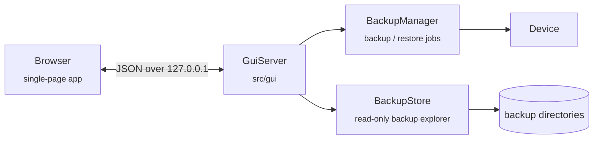

# The web GUI

```sh
abp gui
```

That starts a small HTTP server on `127.0.0.1:8787`, opens your browser at
it, and gives you the same backup/restore/inspect functionality as the CLI
— device discovery, a package picker, live progress, and a browser for
backups already on disk.



There is nothing to install: the page is compiled into the `abp` binary,
loads no fonts, scripts or styles from the network, and talks only to the
server that served it.

## Options

| Option | Default | Description |
|---|---|---|
| `--port PORT` | `8787` | Port to listen on. `0` picks a free one and prints it. |
| `--host ADDR` | `127.0.0.1` | Address to bind. Loopback only unless you change it. |
| `-d, --backup-dir DIR` | current directory | Where the **Explore backups** view starts looking. |
| `--scan-depth N` | `2` | How many directory levels below that to search. |
| `--no-browser` | — | Don't open a browser; just print the URL. |
| `-v, --verbose` | — | Include debug-level lines in the live log. |

`--adb-path` / `ABP_ADB_PATH` work here exactly as they do for the other
subcommands.

## What each view does

- **Devices** — everything `adb devices -l` can see, with model, Android
  version and root status. Pick one; backups and restores target it.
- **Back up** — choose an output directory, what to capture (APKs, app
  data, shared storage and SD cards, contacts/messages/calendar/settings/Wi-Fi,
  system apps, and optionally every device
  partition as with `--all-files`), which backend to use, and
  optionally an explicit package list pulled live from the device. The
  same options as `abp backup`, with a confirmation step before anything
  runs.
- **Restore** — point at a backup directory, review what its
  `manifest.json` says was captured, tick the packages to restore, and
  go. Mirrors `abp restore`, including the warning when a root-mode
  backup is being restored onto a device without root.
- **Explore backups** — scans a folder for directories containing a
  `manifest.json` and lists what each one holds: device, capture date,
  backend, per-package archive sizes and how each package's data was
  captured (root tar, `run-as` or legacy `adb backup`), per-package
  errors, any raw device-path captures and whether they are complete, and
  a file browser over the backup directory itself. No device needed.

While a backup or restore runs, a drawer at the bottom of the page shows
a progress bar for the current step (`Backing up app data · 12/48 ·
com.example.app`), the live log, and a **Cancel** button. When the job
ends, its summary appears as tiles above the log, followed by a *Before
relying on this backup* list of everything that could not be captured
(hardware-sealed apps, app data out of reach without root, personal data
the device refused to share). A cancelled backup keeps what it captured.
One job runs at a time; starting a second while one is in flight is
refused.

The **Devices** view refreshes itself every few seconds while it is on
screen, and shows each phone's Android version and root status once
abp has asked it (a few adb calls per device, done once). The **Back
up** view says up front what the selected device will give up, and the
**Explore** view can filter backups and verify one's checksums.

## Security model

The GUI can install apps and overwrite app data on a connected device, so
it is locked down by default:

- **Loopback only.** It binds `127.0.0.1`, so nothing outside this machine
  can reach it unless you pass `--host`.
- **Token required.** A random token is generated at startup and included
  in the URL `abp` prints. Every `/api/...` request must present it in an
  `X-Abp-Token` header, which also means another site's JavaScript cannot
  drive the API from your browser. Set `ABP_GUI_TOKEN` to pin the token
  instead (handy when scripting against the API).
- **Host header checked.** Requests arriving with an unexpected `Host`
  are rejected, so a hostile page cannot use DNS rebinding to talk to the
  server.
- **Backup browsing is sandboxed.** The file browser resolves every path
  inside the backup directory and refuses anything that escapes it, `..`
  and symlinks included.

Passing `--host 0.0.0.0` opts out of the first of those and makes the GUI
reachable from your network; `abp` warns when you do. Anyone who can
reach the port *and* has the token can then back up and restore your
device, so don't do it on a network you don't trust.

## The HTTP API

The GUI is a plain client of a small JSON API, which you can also drive
yourself — for a dashboard, a cron job, or a script:

```sh
abp gui --no-browser &
curl -H "X-Abp-Token: $TOKEN" http://127.0.0.1:8787/api/devices
```

| Method | Endpoint | Purpose |
|---|---|---|
| `GET` | `/api/status` | abp version, adb availability, backup root, current job. |
| `GET` | `/api/devices` | Connected devices (as `abp devices`). |
| `GET` | `/api/device?serial=` | One device's details (as `abp info`). |
| `GET` | `/api/packages?serial=&system=1` | Installed packages (as `abp list-packages`). |
| `GET` | `/api/backups?root=DIR` | Backups found under `DIR`. |
| `GET` | `/api/backup?path=DIR` | One backup's summary and full manifest. |
| `GET` | `/api/backup/files?path=DIR&sub=REL` | Directory listing inside a backup. |
| `GET` | `/api/backup/verify?path=DIR` | Check every file against the manifest (as `abp verify`). |
| `POST` | `/api/jobs/backup` | Start a backup. Body mirrors the CLI options. |
| `POST` | `/api/jobs/restore` | Start a restore. |
| `GET` | `/api/job?since=N` | Job state plus log lines from index `N` on. |
| `POST` | `/api/job/cancel` | Cancel the running job. |
| `POST` | `/api/job/dismiss` | Forget a finished job. |
| `POST` | `/api/shutdown` | Stop the server (what the "Stop server" button calls). |

A backup request body looks like this; every field except `output` is
optional and defaults to the same thing the CLI does:

```json
{
  "serial": "ABC123",
  "output": "~/abp-backups/pixel",
  "include_apks": true,
  "include_data": true,
  "include_shared": true,
  "include_system": false,
  "include_personal": true,
  "mode": "auto",
  "only": ["com.example.one"],
  "exclude": [],
  "all_files": false,
  "pull_paths": ["/data/media"]
}
```

`all_files` and `pull_paths` are the API's `--all-files` and
`--pull-path`. A path `abp` refuses to pull (`/`, `/proc`, a relative
path, ...) fails the request with `400` before anything runs.

A finished job carries its summary in `job.result`. For a backup that is:

```json
{
  "success": true,
  "mode": "standard",
  "package_count": 42,
  "packages_with_data": 30,
  "packages_with_errors": 2,
  "packages_via_root_tar": 0,
  "packages_via_run_as": 4,
  "packages_via_legacy_backup": 26,
  "shared_storage_included": true,
  "filesystem_capture_count": 0,
  "filesystem_partial_count": 0,
  "removable_storage_count": 1,
  "packages_without_data": 26,
  "personal_exports": [
    { "kind": "contacts", "label": "Contacts", "count": 312, "reason": "" },
    { "kind": "wifi", "label": "Wi-Fi networks", "count": -1,
      "reason": "needs root (the passwords are only readable as root)" }
  ],
  "warnings": ["These apps keep secrets sealed by this phone's hardware, ..."],
  "total_bytes": 123456789,
  "total_size_human": "117.74 MB",
  "output_dir": "/home/me/abp-backups/pixel",
  "messages": []
}
```

and for a restore:

```json
{
  "success": true,
  "packages_restored": 14,
  "packages_failed": 1,
  "packages_skipped": 3,
  "shared_storage_restored": true,
  "filesystem_captures_present": 0,
  "contacts_import_path": "/sdcard/Download/abp-contacts.vcf",
  "calendar_import_path": "/sdcard/Download/abp-calendar.ics",
  "wifi_networks_restored": 6,
  "wifi_networks_skipped": 1,
  "messages": []
}
```

In `personal_exports`, `count` is `-1` for a kind that was not exported,
with the reason. `warnings` lists coverage caveats (hardware-sealed apps,
app data out of reach). `wifi_networks_restored` is `-1` when no Wi-Fi
restore was attempted. A restore request takes `include_personal` too, to
control whether contacts and calendar are copied to the device and Wi-Fi
networks re-added.

`packages_skipped` counts packages that were selected but that the backup
held nothing to write back for — no APK and no captured data. They are
neither restored nor failed; see the restore summary section of
[USAGE.md](USAGE.md).

Errors come back as `{"error": "..."}` with a meaningful status code
(`400` bad request, `403` bad token or sandbox escape, `404` unknown
device or backup, `409` a job is already running). When a device cannot
be used, the error says why: not connected, unauthorized, offline, or
several devices connected with no `serial` chosen.
